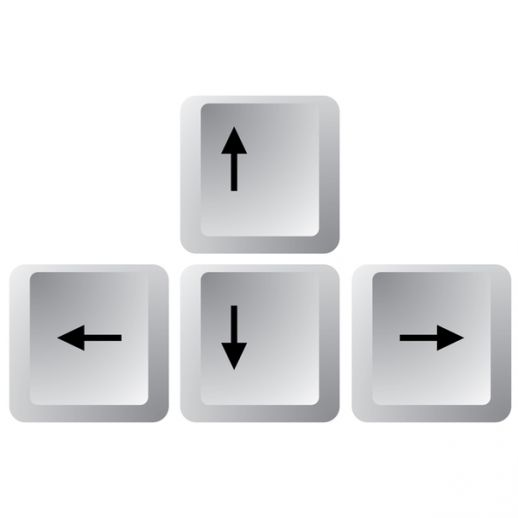
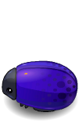

# Frogger (Clone) : The Bug Runner !

This is the source code for the [Udacity's](https://udacity.com/) game project using Javascript, for a lesson conclusion.

[PLAY THE GAME](https://azevedorafael.github.io/frontend-nanodegree-arcade-game/)

## How to Run and Contribute

First, fork this repository.


Next, clone this repository to your desktop to make changes.

```sh
$ git clone {YOUR_REPOSITORY_CLONE_URL}
$ cd frontend-nanodegree-arcade-game
```

Once you've pushed changes to your local repository, you can issue a pull request by clicking on the green pull request icon.


Instead of cloning the repository to your desktop, you can also go to your fork on GitHub.com, hit the Edit button (the button with the pencil) to edit the file in your browser, then hit the `Propose file change` button, and finally make a pull request.

## How to Play

Click in the link -> [PLAY THE GAME](https://azevedorafael.github.io/frontend-nanodegree-arcade-game/)

You will control one of the following characters:

(images/char-boy.png) (images/char-cat-girl.png) (images/char-horn-girl.png) (images/char-pink-girl.png) (images/char-princess-girl.png)

Use the **arrow keys** to move in the board, you can't go out of the game bounds!



Your goal is to reach the **item** floating in the water, but be careful, you don't know how to swim!

    

And don't forget to avoid the enemy **bugs**!

 

## Resources

* **index.html** is the View for the game.
* The **js** folder contains the game logic:
        <br>- **app.js** has the entity Models (Enemy, Player, Itens and Game Session);
        <br>- **engine.js** controls the main functions game (Controller);
        <br>- **resource.js** loads the images for the game, easing the process of loading;

## License

The contents of this repository are covered under the [MIT License](LICENSE).

